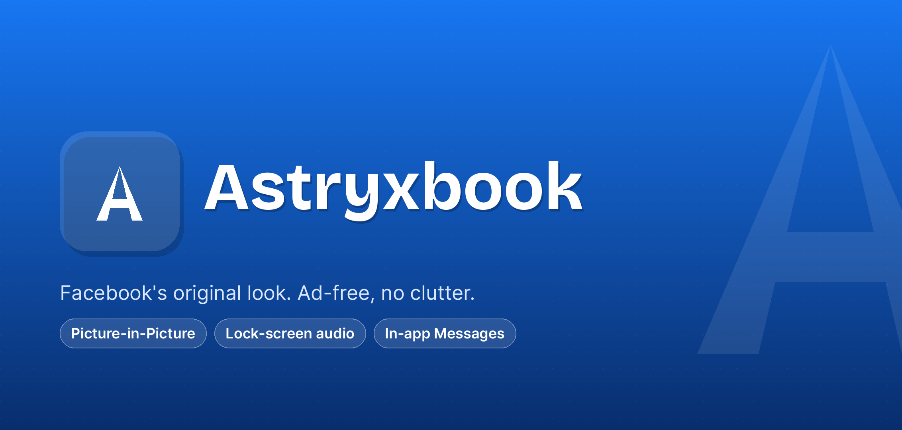

<p align="middle">
    
</p>

<h1 align="middle">
    📱 Download
</h1>

<p align="middle">
    <a href='https://github.com/ofirc73/AstryxBook/releases/latest'></a>
</p>

<p align="middle">
    <a href='https://grev.shehryar.ae/?owner=ofirc73&repo=AstryxBook'></a>
</p>

<h2 align="middle">
    🙋 Have issues?
</h2>

<p align="middle">
    <a href='https://github.com/ofirc73/AstryxBook/issues/new/choose'></a>
</p>

<h2 align="middle">
    ✏️ This fork:
</h2>

*  Renames the app to **Astryxbook**, with an original "A" monogram launcher icon (Facebook blue, but not Facebook's own trademarked logo — avoids impersonation/trademark issues)
*  Restyles it to match **Facebook's own original Android look** — Material You theming and AMOLED Black now ship **off by default**, using Facebook's native blue instead of your wallpaper colors out of the box
*  Both settings remain available as opt-in toggles for anyone who preferred the upstream [Materialbook](https://github.com/eepiemi/Materialbook) look
*  Everything below still applies whenever those toggles are switched on
*  See [FORK_CHANGES.md](./FORK_CHANGES.md) for the full list of changes in this fork

<h2 align="middle">
    ⚙️ Features
</h2>

Most features are toggles in the app's Settings.

On by default:
*  Blocks sponsored ads
*  Keeps the navigation bar at the top
*  Downloads media or copies it to the clipboard

Off by default (opt-in):
*  Uses Material You colors instead of Facebook's blues (Facebook's own blue is the default theme)
*  Makes Facebook AMOLED Black
*  Hides distractions like:
    *  Suggested posts
    *  Reels
    *  Stories
    *  Groups
    *  People you may know
*  Hides the system bars (immersive mode)
*  Allows pinch-to-zoom anywhere
*  Lets you access Messenger (Desktop layout only)
*  Opens Messages inside the app on the desktop site, in its own layer over the feed, so Back returns you to where you were; it can turn to landscape for more room (Settings → *Messages in desktop mode*); links to a conversation keep it
*  Supports Picture-in-Picture playback with selectable portrait-window ratios
*  Keeps a Picture-in-Picture video's audio playing when the screen locks
*  Keeps the screen on while a video plays, or whenever the app is open (Settings → *Keep screen on*)

Always on:
*  Supports real fullscreen video, including landscape, from Facebook's fullscreen button
   (on phones the app otherwise stays in portrait, apart from Messages, since Facebook's mobile site breaks in landscape)
*  Supports English, Arabic, Bengali, German, Hebrew (`עברית`), Italian, Spanish, French, Portuguese, and Traditional Chinese
*  And more!

<h2 align="middle">
    🖼️ Picture-in-Picture
</h2>

To use Picture-in-Picture:

1. Enable **Picture-in-Picture** in the app's Settings.
2. Tap **PiP aspect ratio** (shown when PiP is enabled) and choose the window ratio for portrait videos:
   * **4:7** (recommended; default)
   * **2:3**
   * **3:4**
   * **9:16** (may overflow on some devices)
3. If needed, also allow PiP in Android under **Settings > Apps > Astryxbook > Picture-in-picture**.
4. Open a Facebook video or Reel and start playback.
5. Keep the video visible and audible, then use the Home gesture or Home button.

On Android 12 and newer, PiP is configured for a smooth automatic transition as you leave
the app. On older supported Android versions, PiP is entered when Android notifies the app
that it is being left.

The app ignores muted feed autoplay and selects the largest visible audible video when
multiple videos are present. Landscape videos use their detected source ratio when available,
including ratios such as 7:4, 4:3, and 16:9, with 16:9 fallback when dimensions are unavailable.
Portrait videos use the ratio selected in Settings, and a changed selection is applied immediately
to the active video without restarting the app.

The default 4:7 ratio is a reliable compromise: it stays close to the video's true 9:16
shape while avoiding the oversized or off-screen window seen on some devices. The wider
4:7, 2:3, and 3:4 windows crop the top and bottom as needed to fill the PiP window without
black bars. Selecting 9:16 preserves the exact video shape, but the window may overflow on
some devices. Extreme detected landscape ratios are clamped to Android's supported PiP range.

The page itself is hidden while in PiP so only the video shows, filling the window.
Rotating the phone while a video is in PiP keeps the same video playing.

To keep listening with the screen locked, also turn on **Keep audio when screen locks**
(shown under the PiP settings). Locking the screen while a video is in PiP then hands its
audio to a native player, with media controls on the lock screen. Unlocking hands it back to
the video at the same position. Facebook's video links expire after a while, so audio during
a very long lock can stop; the video is still restored where it left off.

A video that was playing keeps playing when PiP starts, on the mobile and the desktop site.
If it ever stops, tap the Play button on the PiP overlay to resume it.

If PiP does not appear, confirm that the video is actively playing with volume above zero
and that both the app and Android system PiP permissions are enabled.

<h2 align="middle">
    🛠️ Setup
</h2>

Astryxbook requires Android 8.0 (API level 26) or newer.

1.  **Clone the repository**
    * In Android Studio:
      * File > New > Project from Version Control
      * Paste `https://github.com/ofirc73/AstryxBook.git` and clone.
    * Or via terminal:
    ```
    git clone https://github.com/ofirc73/AstryxBook.git
    cd AstryxBook
    ```
2.  **Open in Android Studio.** (only if cloned via terminal)
    * Select Open an Existing Project and choose the cloned folder.
3.  **Sync the project** to download dependencies.
4.  **Run the app** in a device or emulator.

<h2 align="middle">
    ✅ Testing
</h2>

Covers the rebrand and default-behavior changes in this fork — defaults (Material You/AMOLED off), theme colors, app identity/strings, launcher icon, applicationId, and the pinned scripts source.

*  **Unit tests** (no device/emulator needed): `./gradlew test`
*  **Android lint** (no device/emulator needed): `./gradlew :app:lintDebug`
*  **Instrumented tests** (needs a connected device or running emulator): `./gradlew connectedAndroidTest`

GitHub Actions runs all three checks. Android lint reports are uploaded as a workflow artifact for every run. The lint gate treats dependency-update notices as advisory while still failing on actionable Android findings.

<h2 align="middle">
    💗 Acknowledgement:
</h2>

*  This is a fork of [Materialbook](https://github.com/eepiemi/Materialbook) by eepiemi, itself a fork of [Nobook](https://github.com/ycngmn/Nobook) by ycngmn
*  [@KevinnZou/compose-webview-multiplatform](https://github.com/KevinnZou/compose-webview-multiplatform)

<h2 align="middle">
    ⚖️ License
</h2>

Astryxbook is free software, licensed under the [GNU General Public License v3.0](./LICENSE), the same license as Materialbook and Nobook, which it's based on.

*  Copyright (C) 2026 Ofir Cohen, for the changes made in this fork (see [FORK_CHANGES.md](./FORK_CHANGES.md))
*  The original code remains copyright of its authors: eepiemi (Materialbook) and ycngmn (Nobook)

You may use, change and share it under the GPL-3.0's terms: copies and modified versions must stay under the same license, with their source code available and these copyright notices kept.

The name "Astryxbook" and its logo aren't covered by the license: modified versions need their own name, logo and application ID. See [NOTICE.md](./NOTICE.md) for these additional terms (GPL-3.0, section 7).
